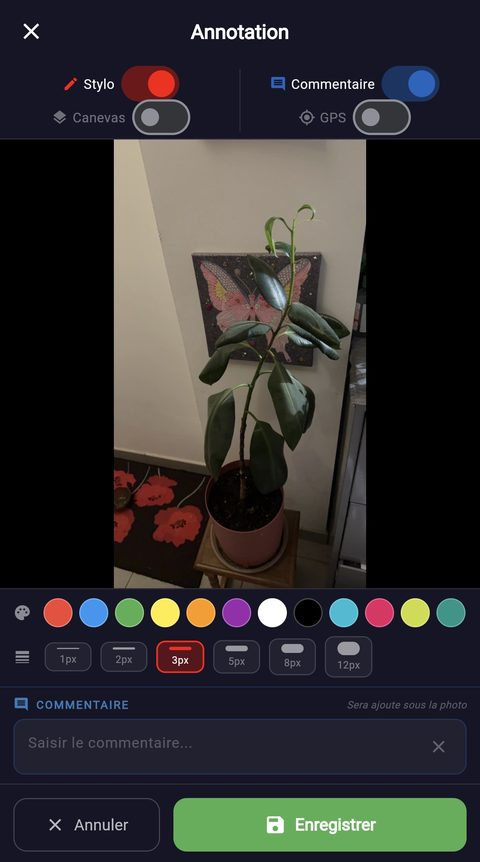
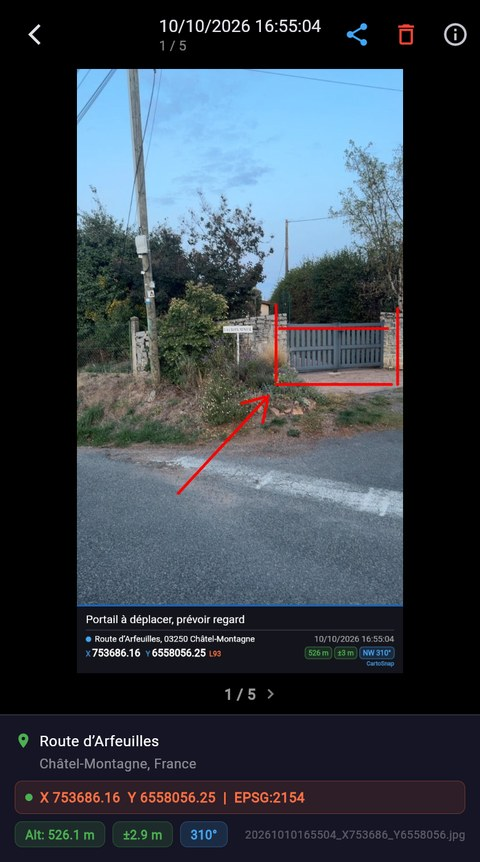
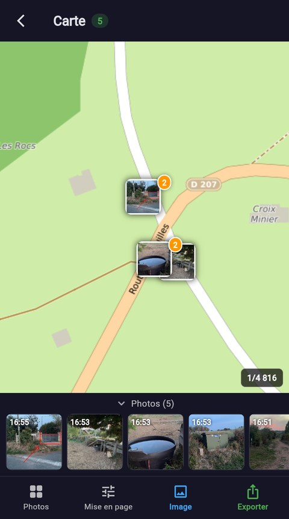
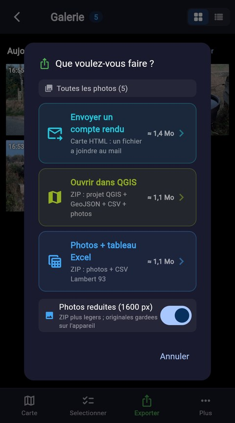
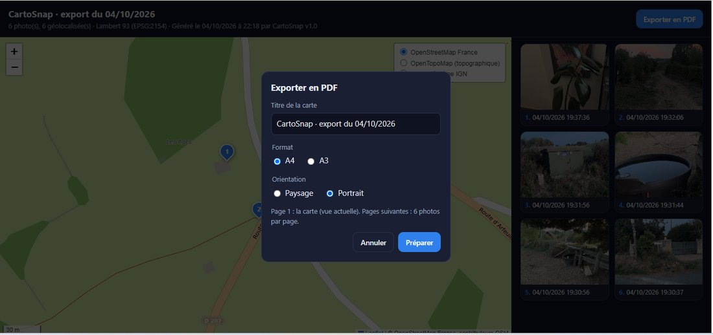
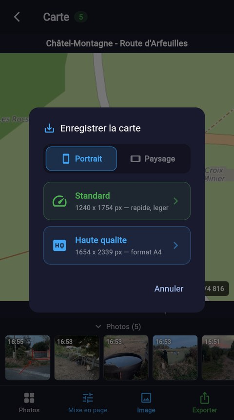

<div align="center">

# CartoSnap

*(anciennement LambertSnap)*


**Appareil photo de terrain qui nomme, annote et géoréférence chaque cliché en Lambert 93, puis l'exporte prêt à ouvrir dans QGIS**

[](https://flutter.dev)
[](pubspec.yaml)
[](https://github.com/Cartoyoyo/CartoSnap-APK/releases)
[](https://cartoyoyo.github.io/CartoSnap-APK/)
[](https://cartoyoyo.github.io/CartoSnap-web/)
[](lib/services/coordinate_converter.dart)
[](#français)

</div>

---

<div align="center">

## Aperçu rapide · Quick Overview

| 1 — Viser | 2 — Annoter | 3 — Retrouver |
|:---:|:---:|:---:|
|  |  |  |
| Position GPS, adresse et X/Y Lambert 93<br>en direct, cap, mini-carte ronde | Stylo 12 couleurs, commentaire<br>et canevas ajoutés sous la photo | Galerie classée par jour,<br>en grille ou en liste |

| 4 — Vérifier | 5 — Situer | 6 — Exporter |
|:---:|:---:|:---:|
|  |  |  |
| Canevas sous la photo, X/Y, altitude,<br>précision et cap enregistrés | Carte des photos, bandeau de vignettes,<br>mise en page et image JPEG | Compte rendu (Carte HTML), projet QGIS<br>ou photos + tableau Excel |

| Résultat : la Carte HTML ouverte dans un navigateur |
|:---:|
|  |
| Un seul fichier `.html` à partager : carte (OSM France, OpenTopoMap, photo aérienne IGN), marqueurs numérotés,<br>coordonnées Lambert 93, photos intégrées et bouton **Exporter en PDF** |

| Exporter en PDF | Rapport — page 1 : la carte | Rapport — page 2 : 6 photos par page |
|:---:|:---:|:---:|
|  | [](docs/exemple_rapport_cartosnap.pdf) | [](docs/exemple_rapport_cartosnap.pdf) |
| Titre, A4 ou A3,<br>portrait ou paysage | Vue de la carte, marqueurs<br>numérotés, échelle | Photo, date, X/Y Lambert 93,<br>adresse, altitude, précision |

📄 [Voir le rapport PDF d'exemple](docs/exemple_rapport_cartosnap.pdf) (A4 portrait, 2 pages)

**Télécharger :** [APK Android](https://cartoyoyo.github.io/CartoSnap-APK/) · [Version web pour iPhone (Safari)](https://cartoyoyo.github.io/CartoSnap-web/)

</div>

---

## Français

### Description

CartoSnap est une application mobile Flutter qui prend des photos géolocalisées et calcule leurs coordonnées en **Lambert 93 (EPSG:2154)** directement sur le téléphone, sans service en ligne ni bibliothèque de projection externe. Chaque photo reçoit un nom normalisé, un bandeau de coordonnées incrusté, et peut ensuite être exportée en CSV, GeoJSON, projet QGIS ou **Carte HTML** à partager, d'où l'on tire un **rapport PDF**. L'application fonctionne sur Android (APK) et sur iPhone (version web dans Safari).

Fini les photos de chantier à relocaliser à la main : visez, déclenchez, et le fichier porte déjà dans son nom la date et la position X/Y au mètre près. De retour au bureau, un ZIP « QGIS » s'ouvre directement sur un fond OpenStreetMap, avec un point par photo.

### Fonctionnalités

- **Conversion Lambert 93 embarquée** : projection conique conforme RGF93 / GRS80 (algorithmes IGN), aller et retour WGS84 ↔ Lambert 93, écart nul au millimètre près avec PROJ.
- **Nommage automatique** : `AAAAMMJJHHMMSS_X652469_Y6862035[_suffixe].jpg`, à l'heure de la prise de vue, avec un suffixe de chantier facultatif (accents retirés, seuls lettres, chiffres, `-` et `_` gardés).
- **Photos en pleine résolution** : résolution maximale du capteur, gardée telle quelle sur l'appareil ; la réduction (1600 px) se fait à l'export si on le souhaite.
- **Bandeau GPS sous la photo** : adresse, `X … Y … | EPSG:2154`, altitude, précision et cap, ajoutés automatiquement sous l'image (sans la masquer) quand l'annotation est désactivée. Sur Android, il se désactive (*Réglages → Bandeau sous la photo*) : la photo de l'appareil est alors gardée telle quelle, seul l'EXIF CartoSnap est ajouté, et l'enregistrement est quasi instantané.
- **Viseur dégagé** : état GPS, heure et boutons posés sur un léger voile en haut ; bandeau de 2 lignes en bas (adresse, X/Y Lambert 93 ou WGS84, altitude, précision — vert ≤ 10 m, orange ≤ 30 m, rouge au-delà —, cap), repliable en pilule d'une ligne ; mini-carte ronde agrandissable ; disposition adaptée au paysage. Une perte de signal GPS est signalée et la photo est alors enregistrée sans coordonnées.
- **Boussole** : cap de prise de vue (direction de l'objectif) affiché dans le viseur et enregistré dans l'EXIF (`GPSImgDirection`, nord magnétique sous Android et sur le web, nord vrai sous iOS natif), y compris dans Safari sur iPhone (autorisation demandée au premier toucher). Valeur lissée, capteur relancé s'il se fige. Sans boussole, le cap GPS est utilisé.
- **Choix d'objectif** : sélecteur 0.5x / 1x / téléobjectif quand le téléphone expose plusieurs caméras arrière, en plus du zoom par pincement et de la bascule avant/arrière.
- **Annotation après capture** : stylo (12 couleurs, 6 épaisseurs, annuler), commentaire, et **canevas** ajouté sous la photo (commentaire, adresse et date, X/Y Lambert 93, altitude, précision, cap), activable par défaut dans les réglages.
- **Géocodage inverse** : adresse courte via Nominatim (OSM) — numéro et rue, sinon lieu-dit ou hameau, sinon commune — limitée à une requête par seconde et déclenchée après 3 s de position stable.
- **Galerie** : photos **regroupées par jour** (un jour ≈ un chantier), en grille (2 photos par ligne) ou en liste, avec « Exporter ce jour » ; barre d'actions en bas (Carte, Sélectionner, Exporter, Plus) ; sélection par jour avec compteur ; partage, suppression, vue plein écran avec coordonnées Lambert 93.
- **Carte des photos** : vignettes regroupées par proximité, bandeau de vignettes dépliable (toucher = centrer la carte), échelle affichée et forçable (1/250 à 1/25 000), barre d'actions en bas (Photos, Mise en page, Image, Exporter), image JPEG A4 (portrait ou paysage, standard ou haute qualité, 100 dpi) avec titre et commentaire.
- **Exports** : 3 choix nommés par usage — *Envoyer un compte rendu* (Carte HTML), *Ouvrir dans QGIS* (ZIP : projet, GeoJSON, CSV, photos), *Photos + tableau Excel* (ZIP : photos + CSV) — avec la taille estimée, sur toutes les photos, un jour ou une sélection ; photos réduites à 1600 px (EXIF conservé) ou originales, au choix (détail dans [Contenu des exports](#contenu-des-exports)).
- **Carte HTML** : un seul fichier `.html`, lisible dans n'importe quel navigateur sans logiciel : carte Leaflet avec choix du fond (OSM France, OpenTopoMap, photo aérienne IGN), marqueurs numérotés, popup avec la photo, la date, les X/Y Lambert 93, l'adresse et la précision, visionneuse plein écran, grille de toutes les photos (y compris sans GPS). Les photos sont réduites à 1600 px et intégrées au fichier, qui reste envoyable par mail.
- **Rapport PDF** (bouton *Exporter en PDF* de la Carte HTML) : titre modifiable, A4 ou A3, portrait ou paysage ; page 1 = la carte telle qu'affichée (fond, marqueurs, échelle), pages suivantes = 6 photos par page avec leurs légendes Lambert 93. Le PDF est produit par la fenêtre d'impression du téléphone ou du PC, sans en-têtes ni pieds de page du navigateur.
- **Version iPhone (web)** : la même application dans Safari, installable sur l'écran d'accueil ; photos gardées dans le navigateur (IndexedDB), partage par la feuille de partage iOS (Enregistrer l'image, AirDrop, Mail), mêmes exports. Voir [Plateformes](#plateformes).
- **Viseur fidèle** : l'aperçu montre l'image entière, exactement le cadrage de la photo enregistrée (bandes noires si l'écran est plus allongé).
- **Localisation coupée ou refusée** : un bandeau rouge l'indique dans le viseur ; sur Android, un toucher ouvre directement les réglages (localisation ou autorisations de l'appli) ; sur iPhone, il ouvre un guide pas à pas des réglages Safari.
- **Projet QGIS prêt à l'emploi** : chaque photo affichée **en vignette encadrée** (nom du fichier sous la photo) reliée à son point par un trait (point bleu = position exacte), sans chevauchement (photos superposées écartées), vignettes déplaçables à la main (outil « Déplacer une étiquette », position enregistrée dans le GeoJSON), info-bulle, action « Ouvrir la photo », chemins relatifs, fond de carte du réglage. Vérifié en chargeant le projet généré dans QGIS 3.44.
- **Fond de carte** : OpenStreetMap France (par défaut) ou OpenTopoMap (topographique), au choix dans les réglages, appliqué à la mini-carte, à la carte des photos, à l'export JPEG A4, au projet QGIS et à l'ouverture de la Carte HTML (qui propose en plus la photo aérienne IGN).
- **Réparation des anciennes photos** (Galerie → ⋮) : reconversion en JPEG des PNG enregistrés en `.jpg`, EXIF GPS réécrit, noms de fichiers renommés avec les X/Y corrigés, position factice de Paris effacée.
- **EXIF GPS** : latitude, longitude, altitude, cap, date et coordonnées Lambert 93 (description) écrits dans chaque photo géolocalisée, y compris après bandeau ou annotation (réencodage JPEG qualité 92 par l'encodeur d'Android, en arrière-plan : le déclencheur reste disponible).
- **Pas de position inventée** : si le GPS est coupé ou refusé, la photo est enregistrée sans coordonnées (`CartoSnap_<date>.jpg`), le témoin passe au rouge, et les exports laissent ses colonnes X/Y vides (géométrie nulle dans le GeoJSON). Le suivi reprend seul quand le GPS est réactivé.
- **Dossier de sauvegarde** : `DCIM/CartoSnap` par défaut, y compris sous Android 10 (autorisation de stockage demandée ; les photos qu'une version précédente avait rangées dans le dossier de l'appli y sont déplacées), ou un dossier choisi par l'utilisateur.
- **Mises à jour sans perte** : les données enregistrées sont versionnées et migrées au démarrage ; après une réinstallation, les photos du dossier sont retrouvées automatiquement à partir de leur EXIF (position, cap, date), ou par Galerie → Plus → *Retrouver mes photos*.

### Plateformes

| | Android (APK) | iPhone (version web, Safari) |
|---|---|---|
| Installation | [page de téléchargement](https://cartoyoyo.github.io/CartoSnap-APK/) | [cartoyoyo.github.io/CartoSnap-web](https://cartoyoyo.github.io/CartoSnap-web/) → *Sur l'écran d'accueil* |
| Où sont les photos | `DCIM/CartoSnap` (visibles dans la galerie du téléphone) | dans Safari (IndexedDB), pas dans la photothèque |
| Partage et exports | feuille de partage Android | feuille de partage iOS, ou téléchargement |
| Boussole (cap EXIF) | oui | oui (autorisation au premier toucher) |
| Choix du dossier, réparation des anciennes photos | oui | masqués (sans objet) |
| Localisation refusée | le bandeau ouvre les réglages | le bandeau ouvre un guide des réglages Safari |
| Hors connexion | photos, coordonnées, exports CSV/ZIP | idem, une fois l'appli chargée |

### Prérequis

| Élément | Version |
|---|---|
| Flutter SDK | compatible Dart `^3.9.2` |
| Android | téléphone avec GPS et caméra |
| Réseau | facultatif : nécessaire pour l'adresse (Nominatim) et les fonds de carte OSM |

> **Permissions Android** déclarées : caméra, localisation précise et approximative, stockage, Internet.
> Sans localisation, les photos restent possibles mais sans coordonnées : l'appli n'invente jamais de position, sur Android comme sur le web.

### Installation

**Sur un téléphone Android** : ouvrez [cartoyoyo.github.io/CartoSnap-APK](https://cartoyoyo.github.io/CartoSnap-APK/) sur le téléphone, touchez *Télécharger l'APK Android*, ouvrez le fichier puis *Installer* (autorisez l'installation depuis le navigateur si Android le demande).

**Sur iPhone** : il n'y a pas d'application iOS (il faudrait un Mac et un compte Apple Developer). Ouvrez [cartoyoyo.github.io/CartoSnap-web](https://cartoyoyo.github.io/CartoSnap-web/) dans **Safari**, autorisez la caméra et la position, puis *Partager → Sur l'écran d'accueil*. Les photos sont gardées dans Safari : exportez-les régulièrement.

**Pour développer** :

```bash
git clone https://github.com/Cartoyoyo/CartoSnap.git
cd CartoSnap
flutter pub get
flutter run            # téléphone branché en mode développeur
flutter build apk      # APK de release dans build/app/outputs/flutter-apk/
```

Lancer les tests (conversion Lambert 93, encodage JPEG, EXIF, exports, réparation, écran de démarrage) :

```bash
flutter test
```

### Utilisation

**1. Viser.** Le viseur affiche en permanence l'état du GPS, l'adresse, les coordonnées X/Y Lambert 93, l'altitude, la précision et le cap. Les pastilles à gauche changent d'objectif (0.5x, 1x, téléobjectif), le pincement zoome, la mini-carte montre la position. Le bouton central prend la photo ; la vignette à gauche ouvre la galerie, le bouton de droite bascule sur la caméra frontale.

<p align="center"></p>

**2. Annoter** (bouton ✎ en haut du viseur). Après chaque capture : stylo (12 couleurs, 6 épaisseurs), commentaire, canevas ajouté sous la photo, puis *Enregistrer*. Sans annotation, le bandeau GPS est ajouté automatiquement sous la photo.

<p align="center"></p>

**3. Retrouver et vérifier.** La galerie (vignette en bas à gauche du viseur) présente les photos jour par jour, en grille ou en liste (bascule en haut à droite). Une photo ouverte montre le bandeau ou le canevas ajouté sous la photo, les X/Y Lambert 93, l'altitude, la précision, le cap et le nom du fichier `AAAAMMJJHHMMSS_X…_Y….jpg`.

<p align="center"> &nbsp; </p>

**4. Situer sur la carte.** Galerie → *Carte* : les photos apparaissent en vignettes ; la languette *Photos* déplie le bandeau des vignettes. *Mise en page* règle le titre et le commentaire, *Image* enregistre ou partage la carte en JPEG (portrait ou paysage, standard ou haute qualité A4).

<p align="center"> &nbsp; </p>

**5. Exporter.** Galerie → *Exporter* (ou *Exporter ce jour*, ou une sélection), ou *Exporter* sur la carte. Choisissez *Envoyer un compte rendu* (Carte HTML), *Ouvrir dans QGIS* ou *Photos + tableau Excel* ; la taille estimée est affichée, et l'interrupteur *Photos réduites (1600 px)* allège les ZIP. Le fichier est ensuite proposé au partage (mail, messagerie, Drive…).

<p align="center"></p>

**6. Partager la Carte HTML.** Le fichier `.html` s'ouvre dans n'importe quel navigateur, sans logiciel : carte avec choix du fond, marqueurs numérotés, popup avec la photo et les X/Y Lambert 93, grille de toutes les photos. Le bouton **Exporter en PDF** produit un dossier imprimable : titre au choix, A4 ou A3, portrait ou paysage, page 1 = la carte, pages suivantes = 6 photos par page.

<p align="center"></p>

**7. Imprimer un rapport PDF.** Dans la Carte HTML, *Exporter en PDF* → titre, format, orientation → *Préparer* → *Imprimer / Enregistrer en PDF*. Le système produit le PDF (Android : *Enregistrer au format PDF* ; iPhone : *Partager → Imprimer*, puis partager l'aperçu ; PC : *Microsoft Print to PDF*). Les en-têtes et pieds de page du navigateur (date, chemin du fichier) ne sont pas imprimés.

<p align="center"></p>

<p align="center"><a href="docs/exemple_rapport_cartosnap.pdf"></a> &nbsp; <a href="docs/exemple_rapport_cartosnap.pdf"></a><br><a href="docs/exemple_rapport_cartosnap.pdf">Rapport PDF d'exemple</a> (A4 portrait : la carte, puis les photos avec leurs coordonnées)</p>

**8. Ouvrir dans QGIS.** Décompressez le ZIP QGIS et ouvrez le fichier `.qgz` (ou `.qgs`).

**9. Anciennes photos.** Sur Android, une fois après la mise à jour : Galerie → *Plus* → *Réparer les anciennes photos*. Après une réinstallation, les photos du dossier reviennent seules dans la galerie (ou Galerie → *Plus* → *Retrouver mes photos*).

### Contenu des exports

| Export | Fichier produit | Contenu |
|---|---|---|
| Photos + tableau Excel | `CartoSnap_Export_<date>.zip` | CSV (une ligne par photo, séparateur `;`, UTF-8 avec BOM, ouverture directe dans Excel) + `photos/` |
| Ouvrir dans QGIS | `CartoSnap_Export_<date>_QGIS.zip` | GeoJSON Lambert 93, projet `.qgz` et `.qgs` (photos en vignettes, action « Ouvrir la photo »), CSV, `photos/`, `LISEZMOI.txt` |
| Envoyer un compte rendu | `CartoSnap_Carte_<date>.html` | Carte HTML autonome : carte, marqueurs, popups, photos réduites intégrées, bouton *Exporter en PDF* |
| Rapport PDF | au choix (impression) | depuis la Carte HTML : page carte + pages de 6 photos avec légendes |
| Carte JPEG | `CartoSnap_Carte_<Portrait\|Paysage>_<STD\|HQ>_<date>.jpg` | depuis la carte des photos : carte A4 100 dpi avec vignettes, titre, commentaire, échelle |

Colonnes du CSV (et propriétés du GeoJSON) :

| Colonne | Contenu |
|---|---|
| `Nom fichier` | nom de la photo |
| `Date`, `Heure` | horodatage de la capture |
| `X_L93`, `Y_L93` | coordonnées Lambert 93 en mètres, 2 décimales |
| `Systeme` | `EPSG:2154` |
| `Altitude` | altitude GPS (m) |
| `Adresse`, `Code postal`, `Ville`, `Pays` | géocodage Nominatim |
| `Google Maps` | lien vers la position |
| `photo_path` | GeoJSON seulement : `photos/<nom>` |

Les coordonnées des exports sont recalculées à partir de la latitude et de la longitude stockées, au moment de l'export. Dans les ZIP, les photos sont soit les originales, soit des copies réduites à 1600 px qui gardent l'EXIF GPS (interrupteur *Photos réduites*).

### Précision de la conversion Lambert 93

La conversion suit les algorithmes IGN (ALG0054 pour les constantes, ALG0001/0003/0004 pour la projection). Contrôle sur 8 villes de métropole et de Corse (Brest, Bastia, Bonifacio, Dunkerque…) : écart inférieur au millimètre par rapport à PROJ, aller-retour inférieur à 0,01 mm.

Le GPS fournit des coordonnées WGS84, traitées ici comme RGF93. L'écart entre les deux référentiels est inférieur au mètre (dérive d'environ 2,5 cm par an depuis 1989), bien en dessous de la précision d'un GPS de téléphone (3 à 10 m).

> **Correctif du 04/10/2026.** Les versions précédentes calculaient mal l'exposant `n` de la projection (0,7302 au lieu de 0,7256). L'erreur était nulle à l'origine de la projection (46,5° N, 3° E, près de Moulins) et grandissait avec la distance : environ 14 m à Vichy, 113 m à Paris, 245 m à Lille et 300 m à Brest.
> Pour les photos prises avant ce correctif, *Réparer les anciennes photos* corrige le nom de fichier et l'EXIF. **Le bandeau incrusté dans l'image garde les anciennes coordonnées.** Les exports CSV, GeoJSON et QGIS sont justes dès le prochain export, car ils repartent de la latitude et de la longitude.

### Limitations connues

| Sujet | État actuel du code |
|---|---|
| Bandeau des photos antérieures à 0.94 | Les coordonnées incrustées dans l'image ne peuvent pas être recalculées. La réparation corrige le nom, l'EXIF et le format, pas les pixels. Les photos prises GPS coupé gardent le bandeau de Paris. |
| Objectifs sous Android | CameraX ne précise pas le type des caméras : l'étiquette 0.5x / téléobjectif est déduite de l'ordre des caméras et peut être fausse. Beaucoup de téléphones n'exposent qu'une caméra arrière, et le sélecteur est alors masqué. |
| Objectifs sur iPhone (web) | Safari ne donne que le nom des caméras : le classement 0.5x / 1x / T se fait sur ce nom (« ultra grand-angle », « téléobjectif »), les caméras virtuelles double/triple sont écartées. |
| Photos de la version web | Gardées dans Safari, pas dans la photothèque : à exporter ou partager régulièrement. Safari peut effacer les données d'un site non installé sur l'écran d'accueil. |
| Carte HTML hors connexion | Les photos et les coordonnées s'affichent, mais la carte (Leaflet et fonds) a besoin d'internet à l'ouverture. |
| Rapport PDF | Produit par la fenêtre d'impression du système (*Enregistrer en PDF*), pas par l'application elle-même. |
| Résolution sur iPhone (web) | Safari capture une image du flux vidéo de la caméra (jusqu'à la 4K, en 16:9), pas une photo de l'appareil photo natif de l'iPhone. |
| Signature de l'APK | Depuis la 1.3.0, l'APK est signé avec la clé de l'application : les mises à jour suivantes s'installent par-dessus. En venant d'une version antérieure (clé de test), une **dernière désinstallation** est nécessaire : les photos de `DCIM/CartoSnap` restent sur le téléphone et sont retrouvées au démarrage (position, cap, date), sans leur adresse. Sur Android 10, les versions antérieures rangeaient les photos dans `Android/data/com.geosnap.camera/files/CartoSnap`, effacé à la désinstallation : copiez ce dossier vers `DCIM/CartoSnap` (câble USB) avant de désinstaller. |

---

## English

### Description

CartoSnap is a Flutter field camera app that geotags photos and computes their **Lambert 93 (EPSG:2154)** coordinates on the device, with no online service and no external projection library. Photos are kept at **full sensor resolution**, get a standardised file name and a coordinate banner added **below** the image, and can be exported as an **HTML map** (printable to a **PDF report**), a ready-to-open **QGIS project** or photos + CSV for Excel. It runs on Android (APK) and on iPhone (web version in Safari).

### Features

- **Built-in Lambert 93 conversion**: RGF93 / GRS80 conformal conic projection (IGN algorithms), WGS84 ↔ Lambert 93 both ways, sub-millimetre agreement with PROJ.
- **Automatic naming**: `YYYYMMDDHHMMSS_X652469_Y6862035[_suffix].jpg`, at capture time, with an optional site suffix (accents removed, only letters, digits, `-` and `_` kept).
- **Full-resolution photos**, kept as they are on the device; downscaling to 1600 px is optional at export.
- **Clean viewfinder**: GPS status, time and buttons on a light top gradient; two-line bottom banner (address, Lambert 93 or WGS84 X/Y, altitude, accuracy colour-coded, heading) that folds into a one-line pill; round mini-map that expands on tap; landscape layout. A lost GPS signal is flagged and the photo is then saved without coordinates.
- **Compass**: camera heading shown in the viewfinder and stored in EXIF (`GPSImgDirection`), on Android and in Safari on iPhone (permission asked on first tap); smoothed, restarted if the sensor freezes.
- **Annotation**: pen (12 colours, 6 widths, undo), comment, and a **canvas added below the photo** (comment, address and date, Lambert 93 X/Y, altitude, accuracy, heading). Without annotation, a GPS banner with the heading is added below the photo.
- **Reverse geocoding** through Nominatim (OSM), 1 request per second, short address (street, else hamlet, else town).
- **Gallery grouped by day** (one day ≈ one site), grid or list, *Export this day*, bottom action bar (Map, Select, Export, More), per-day selection with counters.
- **Photo map**: clustering, foldable thumbnail strip (tap = centre the map), forced scale, bottom action bar (Photos, Layout, Image, Export), A4 JPEG map at 100 dpi (portrait or landscape, standard or high quality) with title and comment.
- **Exports**, three usage-based choices with an estimated size: *Send a report* (HTML map), *Open in QGIS* (ZIP: project, GeoJSON, CSV, photos), *Photos + Excel table* (ZIP: photos + CSV); all photos, one day or a selection; photos downscaled to 1600 px (EXIF kept) or original.
- **HTML map**: one self-contained `.html` file readable in any browser: Leaflet map with basemap switch (OSM France, OpenTopoMap, IGN aerial imagery), numbered markers, popups with photo, date, Lambert 93 X/Y, address and accuracy, full-screen viewer, grid of all photos. Photos are downscaled to 1600 px (by the browser itself on the web version) and embedded, so the file can be e-mailed.
- **PDF report** (*Exporter en PDF* button of the HTML map): editable title, A4 or A3, portrait or landscape; page 1 = the map as displayed, next pages = 6 photos per page with Lambert 93 captions; produced by the system print dialog, without browser headers and footers.
- **iPhone (web) version**: the same app in Safari, installable on the home screen; photos kept in the browser (IndexedDB), shared through the iOS share sheet, same exports.
- **Location off or denied**: a red banner says so; on Android it opens the system settings, on iPhone it opens a step-by-step Safari settings guide.
- **Basemap setting**: OpenStreetMap France or OpenTopoMap, used by every map and the QGIS project.
- **Updates without data loss**: stored data is versioned and migrated at startup; after a reinstall, photos found in the folder are recovered from their EXIF (position, heading, date), or through Gallery → More → *Find my photos*.
- **GPS EXIF** in every geotagged photo, banner and annotation included.
- **No made-up position**: with GPS off, denied or lost, photos are saved without coordinates (empty X/Y in exports, null geometry in GeoJSON); tracking resumes when the signal returns.
- **French interface**, including the standard Flutter texts (tooltips, menus).

### Installation

**Android**: open [cartoyoyo.github.io/CartoSnap-APK](https://cartoyoyo.github.io/CartoSnap-APK/) on the phone and install the APK.
**iPhone**: open [cartoyoyo.github.io/CartoSnap-web](https://cartoyoyo.github.io/CartoSnap-web/) in Safari, allow camera and location, then *Share → Add to Home Screen*.

```bash
git clone https://github.com/Cartoyoyo/CartoSnap.git
cd CartoSnap
flutter pub get
flutter run
flutter test
```

### Usage

The step-by-step screenshots are in [Aperçu rapide](#aperçu-rapide--quick-overview) and in the French *Utilisation* section: aim (✎ button to annotate), annotate, browse the gallery by day, place photos on the map (*Map*, thumbnail strip, *Layout*, *Image*), then *Export*: HTML map (with a **PDF export** button), QGIS project or photos + CSV.

### Accuracy and fix of 2026-10-04

Earlier versions computed the projection exponent `n` incorrectly (0.7302 instead of 0.7256), causing errors from zero at the projection origin (near Moulins) up to about 300 m in Brittany. Photos taken before the fix keep wrong coordinates in their file name, banner and EXIF description. CSV, GeoJSON and QGIS exports are correct on the next export.

### Known limitations

Banners of photos taken before 0.94 keep their old coordinates (the repair tool fixes names, EXIF and format, not pixels). Android lens labels are guessed; on iPhone they come from Safari's camera names. On iPhone the web version captures a frame of the camera video stream (up to 4K, 16:9), not a photo from the native camera app. Web photos live in Safari, not in the Photos app: export them regularly. The HTML map needs internet for its basemaps. The PDF report is made by the system print dialog. The APK is signed with a test key: Android may require uninstalling the previous version before an update (photos in `DCIM/CartoSnap` stay on the phone and are recovered at startup, without their address). See the French tables above for details.

---

## Español

### Descripción

CartoSnap es una aplicación Flutter de cámara de campo que georreferencia cada foto y calcula sus coordenadas **Lambert 93 (EPSG:2154)** en el propio teléfono. Las fotos se guardan **a resolución completa**, con nombre de archivo normalizado y banda de coordenadas añadida **debajo** de la imagen, y se exportan como **mapa HTML** (con informe PDF), **proyecto QGIS** o fotos + CSV para Excel. Funciona en Android (APK) y en iPhone (versión web en Safari).

### Funcionalidades

- Conversión WGS84 ↔ Lambert 93 integrada (algoritmos IGN)
- Nombre de archivo con fecha de la toma y coordenadas X/Y, sufijo de obra opcional
- Fotos a resolución completa; reducción a 1600 px opcional al exportar (EXIF conservado)
- Visor despejado: banda GPS de 2 líneas plegable, minimapa redondo, modo horizontal; pérdida de señal GPS señalada
- Brújula en Android y en Safari (iPhone), rumbo guardado en el EXIF
- Anotación con lápiz y comentario, lienzo añadido debajo de la foto
- Galería **agrupada por día**, cuadrícula o lista, barra de acciones abajo, selección por día
- Mapa de fotos con tira de miniaturas, imagen JPEG A4 con título y comentario
- Exportación en 3 opciones según el uso, con tamaño estimado: **mapa HTML**, **proyecto QGIS** (`.qgz`/`.qgs`, GeoJSON, CSV), fotos + CSV
- **Informe PDF** desde el mapa HTML: título, A4/A3, vertical/horizontal; página 1 = mapa, luego 6 fotos por página
- Actualizaciones sin pérdida: datos versionados, fotos recuperadas tras una reinstalación
- Versión web para iPhone (Safari)

> Las capturas de pantalla se encuentran en la sección [Aperçu rapide](#aperçu-rapide--quick-overview) al inicio de este documento.

### Instalación

**Android**: [APK](https://cartoyoyo.github.io/CartoSnap-APK/) · **iPhone**: [versión web](https://cartoyoyo.github.io/CartoSnap-web/) en Safari

```bash
git clone https://github.com/Cartoyoyo/CartoSnap.git
cd CartoSnap && flutter pub get && flutter run
```

---

## Português

### Descrição

CartoSnap é uma aplicação Flutter de câmara de campo que georreferencia cada fotografia e calcula as suas coordenadas **Lambert 93 (EPSG:2154)** no próprio telemóvel. As fotografias são guardadas **em resolução total**, com nome de ficheiro normalizado e faixa de coordenadas acrescentada **por baixo** da imagem, e exportadas como **mapa HTML** (com relatório PDF), **projeto QGIS** ou fotografias + CSV para Excel. Funciona em Android (APK) e no iPhone (versão web no Safari).

### Funcionalidades

- Conversão WGS84 ↔ Lambert 93 integrada (algoritmos IGN)
- Nome de ficheiro com a data da captura e as coordenadas X/Y, sufixo de obra opcional
- Fotografias em resolução total; redução para 1600 px opcional na exportação (EXIF conservado)
- Visor desimpedido: faixa GPS de 2 linhas recolhível, minimapa redondo, modo paisagem; perda de sinal GPS assinalada
- Bússola em Android e no Safari (iPhone), rumo guardado no EXIF
- Anotação com caneta e comentário, tela acrescentada por baixo da fotografia
- Galeria **agrupada por dia**, grelha ou lista, barra de ações em baixo, seleção por dia
- Mapa de fotografias com faixa de miniaturas, imagem JPEG A4 com título e comentário
- Exportação em 3 opções por utilização, com tamanho estimado: **mapa HTML**, **projeto QGIS** (`.qgz`/`.qgs`, GeoJSON, CSV), fotografias + CSV
- **Relatório PDF** a partir do mapa HTML: título, A4/A3, retrato/paisagem; página 1 = mapa, depois 6 fotografias por página
- Atualizações sem perda: dados versionados, fotografias recuperadas após reinstalação
- Versão web para iPhone (Safari)

> As capturas de ecrã encontram-se na secção [Aperçu rapide](#aperçu-rapide--quick-overview) no início deste documento.

### Instalação

**Android**: [APK](https://cartoyoyo.github.io/CartoSnap-APK/) · **iPhone**: [versão web](https://cartoyoyo.github.io/CartoSnap-web/) no Safari

```bash
git clone https://github.com/Cartoyoyo/CartoSnap.git
cd CartoSnap && flutter pub get && flutter run
```

---

## Deutsch

### Beschreibung

CartoSnap ist eine Flutter-Feldkamera-App, die jedes Foto georeferenziert und seine **Lambert-93-Koordinaten (EPSG:2154)** direkt auf dem Gerät berechnet. Die Fotos werden in **voller Auflösung** gespeichert, erhalten einen normierten Dateinamen und ein Koordinatenband **unter** dem Bild und lassen sich als **HTML-Karte** (mit PDF-Bericht), **QGIS-Projekt** oder Fotos + CSV für Excel exportieren. Sie läuft auf Android (APK) und auf dem iPhone (Web-Version in Safari).

### Funktionen

- Integrierte Umrechnung WGS84 ↔ Lambert 93 (IGN-Algorithmen)
- Dateiname mit Aufnahmezeitpunkt und X/Y-Koordinaten, optionales Baustellen-Suffix
- Fotos in voller Auflösung; Verkleinerung auf 1600 px beim Export wählbar (EXIF bleibt erhalten)
- Aufgeräumter Sucher: zweizeiliges, einklappbares GPS-Band, runde Minikarte, Querformat; GPS-Signalverlust wird angezeigt
- Kompass unter Android und in Safari (iPhone), Blickrichtung im EXIF gespeichert
- Annotation mit Stift und Kommentar, Infobereich unter dem Foto
- Galerie **nach Tagen gruppiert**, Raster oder Liste, Aktionsleiste unten, Auswahl pro Tag
- Fotokarte mit Miniaturleiste, A4-JPEG-Bild mit Titel und Kommentar
- Export in 3 zweckbezogenen Varianten mit geschätzter Größe: **HTML-Karte**, **QGIS-Projekt** (`.qgz`/`.qgs`, GeoJSON, CSV), Fotos + CSV
- **PDF-Bericht** aus der HTML-Karte: Titel, A4/A3, Hoch-/Querformat; Seite 1 = Karte, danach 6 Fotos pro Seite
- Updates ohne Datenverlust: versionierte Daten, Fotos nach einer Neuinstallation wiederhergestellt
- Web-Version für das iPhone (Safari)

> Die Screenshots befinden sich im Abschnitt [Aperçu rapide](#aperçu-rapide--quick-overview) am Anfang dieses Dokuments.

### Installation

**Android**: [APK](https://cartoyoyo.github.io/CartoSnap-APK/) · **iPhone**: [Web-Version](https://cartoyoyo.github.io/CartoSnap-web/) in Safari

```bash
git clone https://github.com/Cartoyoyo/CartoSnap.git
cd CartoSnap && flutter pub get && flutter run
```

---

## Architecture

L'architecture complète (écrans, providers, services, caméra multi-objectifs, boussole, stockage, galerie Android et services externes) est documentée dans [`architecture.d2`](architecture.d2).

```bash
d2 --layout elk architecture.d2 architecture.svg
```

---

## Changelog

| Version | Notes |
|---------|-------|
| **1.3.0 — 10/10/2026** | **Capture plus rapide sur Android** : encodage JPEG par Android (≈ 10 fois plus rapide), enregistrement en arrière-plan, déclencheur libéré tout de suite ; réglage **Bandeau sous la photo** (désactivé : photo de l'appareil gardée telle quelle) ; **photos toujours dans `DCIM/CartoSnap`** sous Android 10 (déplacement automatique depuis le dossier de l'appli, avertissement si l'accès est refusé) ; **APK signé avec la clé de l'application** (mises à jour sans désinstaller) ; galerie à 2 photos par ligne ; exports : photos redressées selon l'orientation EXIF. Les durées de prise et d'enregistrement s'affichent provisoirement après chaque photo |
| **1.2.0 — 10/10/2026** | **Boussole web** (Safari et Chrome) et boussole Android fiabilisée ; **photos en pleine résolution**, réduction 1600 px au choix à l'export (EXIF conservé) ; **nouvelle interface** : viseur dégagé (bandeau GPS 2 lignes repliable, mini-carte ronde, paysage), canevas d'annotation sous la photo, export en 3 choix par usage avec taille estimée, galerie regroupée par jour avec barre d'actions en bas, carte avec bandeau de vignettes ; perte de signal GPS signalée ; heure de prise de vue dans le nom et l'EXIF ; **mises à jour sans perte** (données versionnées, photos retrouvées après réinstallation) ; textes en français ; rapport HTML bien plus rapide sur le web |
| **1.1.0 — 05/10/2026** | Projet QGIS : photos en **vignettes encadrées** (cadre bleu, nom du fichier sur 3 lignes sous la photo) reliées à leur point par un trait de rappel, **sans chevauchement** (photos prises au même endroit écartées), **déplaçables à la main** avec l'outil « Déplacer une étiquette » (position enregistrée dans les champs `label_x` / `label_y` du GeoJSON) ; chemin des photos sans `file:///` |
| **1.0.1 — 04/10/2026** | Rapport PDF de la Carte HTML sans les en-têtes et pieds de page du navigateur (date, titre, chemin du fichier) : marges d'impression nulles, marge de 10 mm recréée dans la page |
| **1.0 — 04/10/2026** | Première version stable de **CartoSnap** (ex LambertSnap) : Android (APK) et iPhone (version web Safari) ; photos géoréférencées Lambert 93, annotation, galerie et carte des photos, exports CSV / ZIP / projet QGIS / Carte HTML avec export PDF ; README illustré |
| **0.97.1 — 04/10/2026** | Adresse courte quand il n'y a pas de rue (lieu-dit ou commune au lieu de l'adresse complète « Minier, Châtel-Montagne, Vichy, Allier, … ») ; les adresses trop longues des photos déjà prises sont raccourcies à l'affichage et dans les exports |
| **0.97 — 04/10/2026** | Carte HTML : bouton **Exporter en PDF** (titre personnalisable, A4 ou A3, portrait ou paysage ; page 1 = la carte telle qu'affichée, pages suivantes = mosaïques de 6 photos avec légendes Lambert 93), enregistré en PDF par la fenêtre d'impression du téléphone ou du PC — fond OpenStreetMap standard retiré (OSM France par défaut) |
| **0.96 — 04/10/2026** | Nouvel export **Carte HTML** : un seul fichier `.html` (carte Leaflet, fonds OSM France / OpenTopoMap + photo aérienne IGN, marqueurs numérotés, popups avec X/Y Lambert 93, photos réduites à 1600 px intégrées, visionneuse plein écran, grille des photos) — viseur fidèle à la photo sur Android et web — bandeau GPS : ouverture des réglages (Android) ou guide Safari (web) — pastilles d'objectif en colonne à gauche — fond de carte **OpenTopoMap** (topographique) dans les réglages — compilation de l'APK par GitHub Actions |
| **0.95 — 04/10/2026 (branche `web`)** | Renommage LambertSnap → CartoSnap (nom affiché, EXIF, exports, dossier `DCIM/CartoSnap` ; la réparation des anciennes photos LambertSnap est conservée) — version web utilisable sur iPhone via Safari : photos stockées dans le navigateur (IndexedDB), partage iOS, export ZIP/CSV/QGIS, installation sur l'écran d'accueil |
| **0.94 — 04/10/2026** | Correction de l'exposant `n` de la projection Lambert 93 (erreur jusqu'à ~300 m) — photos annotées ou avec bandeau enregistrées en vrai JPEG avec EXIF GPS — suppression de la position factice de Paris quand le GPS est coupé, exports sans coordonnées pour ces photos, reprise automatique du suivi — chemin `assets/icon/` corrigé dans `pubspec.yaml` — tests unitaires (conversion, JPEG, EXIF, exports sans GPS) — README réécrit — diagramme `architecture.d2` — boussole branchée (cap EXIF) — sélecteur d'objectif — canal MediaScanner Android — suffixe Portrait/Paysage de l'export carte — fuite du dialogue d'échelle corrigée — version unique `appVersion` — réglage « Horodatage » appliqué au bandeau et au canevas — fond de carte OSM / OSM France branché partout — projet QGIS en `.qgz` avec photos en vignettes — réparation des anciennes photos — GPSTimeStamp EXIF en UTC — test de l'écran de démarrage corrigé |
| **0.93** | Version affichée dans l'application au moment de l'analyse |

---

## Auteur · Author

<div align="center">

Développé par / Developed by **Yoan Laloux**

Technicien SIG — Vichy Communauté · GIS Technician — Vichy Communauté

[](https://www.linkedin.com/in/ylaloux/)
[](https://github.com/Cartoyoyo)

*Concept et idée originale par Yoan Laloux — développé avec l'assistance d'outils d'IA générative.*
*Concept and original idea by Yoan Laloux — developed with the assistance of generative AI tools.*

</div>

---

## Licence · License

Aucun fichier de licence n'est présent dans le dépôt : la licence reste à définir.
No license file is included in the repository yet.

Signaler un problème · Report an issue : [github.com/Cartoyoyo/CartoSnap/issues](https://github.com/Cartoyoyo/CartoSnap/issues)

Données cartographiques © contributeurs OpenStreetMap (ODbL). Géocodage : Nominatim.
